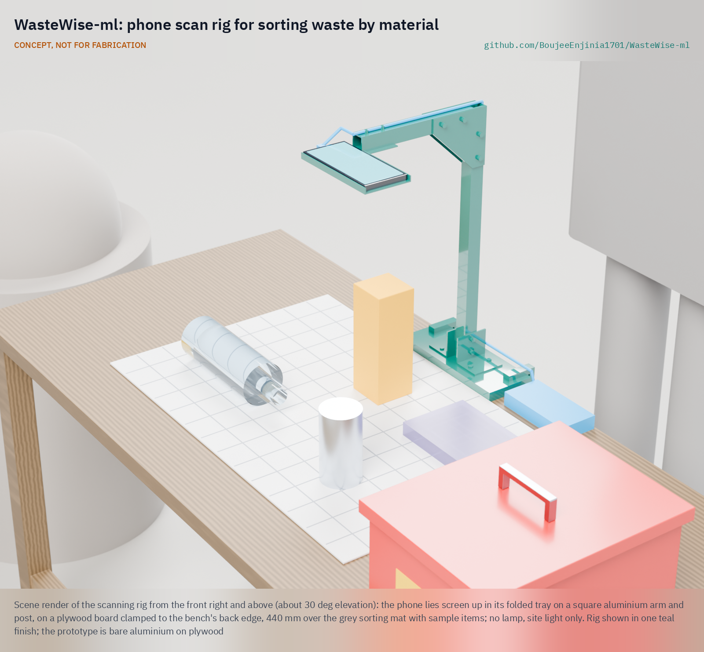
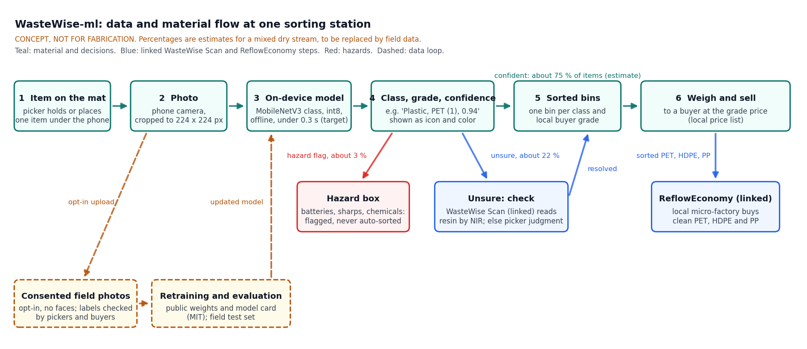
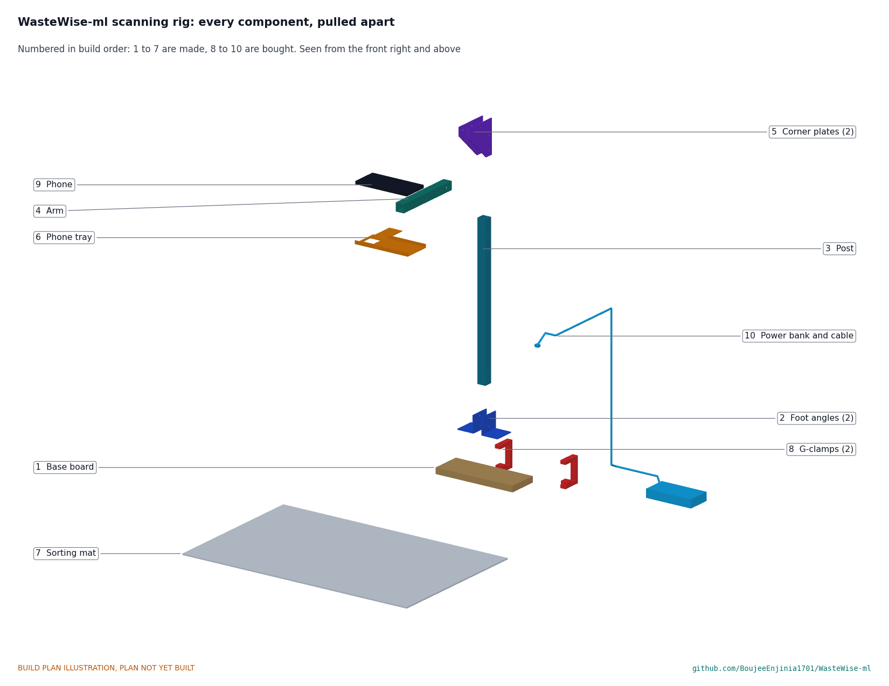

# WasteWise-ml

    

**Area:** Circular Materials · **TRL:** 3 of 9 (proof of concept on paper)

Open image-classification model that identifies waste items by material class and grade from a phone or low-cost camera. It is the software brain of the WasteWise family: WasteWise Scan adds near-infrared sensing for plastic resin type, and ReflowEconomy uses the sorted output.

[Station render](media/render-station.png) · [Interactive 3D model](media/viewer.html) · [Concept blueprint (PDF)](media/concept-blueprint.pdf) · [Prototype build plan](docs/05-build-plan.md) · [Design decisions](docs/06-design-decisions.md) · [Review note](docs/REVIEW.md)

## Concept rationale

The person who can tell PET from PP, a coated carton from plain board, or a clean can from a contaminated one captures the price difference between a buyer's grade and mixed material. Industrial plants make that call with near-infrared sorters that cost far more than a street depot can pay, but almost every waste picker already carries a phone. WasteWise-ml puts a small image classifier (MobileNetV3-Large, about 4.4 MB) on that phone, answers offline in a fraction of a second, and says "Unsure" or "Hazard" rather than guess. Items a camera cannot grade go to WasteWise Scan for a resin reading.

It is open because the value it creates belongs to the people who sort. Code and weights are MIT, every dataset license is recorded, grade names are set per site in a plain file that a cooperative can edit, and field photos are co-owned by the pickers' organization. The reference station is garage-buildable: a low-cost Android phone on a simple aluminium stand over a light mat, with bins, a hazard box and a scale, about $309 in indicative prices.

## Burning platform

The world produced about 2.56 billion tonnes of municipal waste in 2022, and the World Bank expects 3.86 billion tonnes by 2050, with collection rates as low as 31 % in Sub-Saharan Africa ([World Bank, *What a Waste 3.0*](https://www.worldbank.org/en/publication/what-a-waste)). Much of what is recovered at all is recovered by hand: a global model of plastic flows estimated that the informal sector collected about 58 % of the plastic waste gathered for recycling in 2016 ([Lau et al. 2020, *Science*](https://doi.org/10.1126/science.aba9475)), and WIEGO, citing ILO data, puts the number of informal waste pickers at 15 to 20 million ([WIEGO](https://www.wiego.org/informal-economy/occupational-groups/waste-pickers/)).

Those workers are paid by weight and grade, so every item sorted to the wrong grade, or sold as mixed, is income lost. Even where money is not the constraint, sorting remains hard: the United States recycled only about 9 % of the plastics it generated in 2018 ([US EPA](https://www.epa.gov/facts-and-figures-about-materials-waste-and-recycling/national-overview-facts-and-figures-materials)).

## Where it could be used

### By industry

| Industry | Use |
| --- | --- |
| Waste picker cooperatives and associations | Consistent grades across members, training for new members, fewer disputes with buyers |
| Scrap buyers and aggregators | Check incoming lots against the price list; teach sellers new grade names |
| Municipal materials recovery and drop-off points | Quality check on hand-sorted lines and flags for batteries before baling |
| Recycling micro-factories (ReflowEconomy) | Confirm that feedstock is one clean resin before washing and shredding |
| Schools, campuses and events | Teach which bin an item belongs in, with the "Unsure" route shown openly |
| Researchers and NGOs | An open model, taxonomy and evaluation set to extend to new regions and packaging |

### By country or region

| Country or region | Why it matters there |
| --- | --- |
| Brazil | More than 281,000 people work as catadores, many in cooperatives, and Brazil recycles 97 % of its cans ([WIEGO](https://www.wiego.org/informal-economy/occupational-groups/waste-pickers/)); cooperatives give a ready partner for co-design and a shared grade list. |
| Bogotá, Colombia | More than 25,000 waste pickers, tracked in the city's RURO register ([WIEGO](https://www.wiego.org/informal-economy/occupational-groups/waste-pickers/)); a registered workforce suits a co-design pilot. |
| India | WIEGO puts the number of waste pickers at about 2.2 million ([WIEGO](https://www.wiego.org/informal-economy/occupational-groups/waste-pickers/)); multilingual users and low-cost phones match the design's constraints. |
| Sub-Saharan Africa | Collection rates are as low as 31 % and most waste is openly dumped ([World Bank](https://www.worldbank.org/en/publication/what-a-waste)); where formal sorting plants are scarce, a tool that runs on a phone fits the means at hand. |
| European Union | The EU generated 177.8 kg of packaging waste per person in 2023, and only Belgium and Latvia met the 2030 target of 55 % plastic packaging recycling ([Eurostat](https://ec.europa.eu/eurostat/statistics-explained/index.php?title=Packaging_waste_statistics)); better hand sorting at drop-off points helps. |
| United States | 292.4 million tons of municipal waste in 2018 and about 9 % of plastics recycled ([US EPA](https://www.epa.gov/facts-and-figures-about-materials-waste-and-recycling/national-overview-facts-and-figures-materials)); campus and community recycling programs need cheap quality checks. |

## What sparked the idea

The idea traces back to TrashNet, a 2016 Stanford CS 229 project by Gary Thung and Mindy Yang that photographed 2,527 items in six classes (glass, paper, cardboard, plastic, metal and trash) with ordinary iPhones, each item placed on a white posterboard, and trained a network that reached about 75 % test accuracy ([TrashNet repository](https://github.com/garythung/trashnet)). It showed that a phone camera can tell broad material classes apart, and it became a common benchmark. It also showed the gap: a clean white background, six classes and no link to what a buyer pays. A waste picker needs the grade on a dirty, crushed item in a depot or on the street, with an honest "unsure" and a hazard flag. WasteWise-ml keeps TrashNet's premise, one item on a plain surface in front of a phone, and rebuilds the labels, the data and the evaluation around local buyer grades and the people who sort.

## Problem

Recycling streams are contaminated because people and small sorting operations cannot reliably tell materials apart, and value is lost when mixed plastics, paper, metals and organics end up together. Informal waste pickers, who handle most recycling in many low-income countries, earn more only when material is sorted by type and grade.

## Concept

The user photographs one item on a light mat with a low-cost Android phone. An on-device model (MobileNetV3-Large, about 4.4 MB in 8-bit form) answers offline in 64 to 201 ms on a low-cost phone (calculated, WML-CAL-001) with the material class, the local buyer grade and a confidence value, or says "Unsure" or "Hazard". Sorted lots go to bins that match the buyer's price list; unsure plastics go to WasteWise Scan for a near-infrared resin check; clean PET, HDPE and PP can be sold to a ReflowEconomy micro-factory. Consented field photos feed a retraining loop with a fixed field evaluation set.

Full design precis: [docs/02-concept.md](docs/02-concept.md). Sizing of the dataset, model, energy and evaluation: [docs/04-calcs/01-sizing.md](docs/04-calcs/01-sizing.md). General arrangement: [cad/drawings/WML-DWG-001.pdf](cad/drawings/WML-DWG-001.pdf).

**Status at TRL 3 (on paper):** model size, speed, local grades and the reference phone are met; battery life is met if the screen sleeps between scans; class accuracy, hazard recall, coverage (about 68 % against 70 %) and dataset licenses are at risk; grading opaque HDPE versus PP from a photo and the field evaluation set are not met. Nothing has been trained; TRL 4 is on hold.

## Key components

- Open training dataset (curated from public waste image sets plus consented field photos)
- Lightweight model for phones and Raspberry Pi (MobileNetV3 or EfficientNet class), with a material class head and a grade head
- Label taxonomy aligned to resin codes and local buyer grades, mapped per site by a configuration file
- Field evaluation set from real sorting sites, never used for training
- Export to TensorFlow Lite or ONNX, with a model card
- Reference sorting station for a pilot: phone on a made stand, light mat, bins by material class, hazard box, power bank and scale

The pilot list with indicative costs is in [bom/bom.csv](bom/bom.csv). This repository has no hardware budget.

## Building the prototype

WasteWise-ml runs on a phone; its prototype hardware is the scanning rig that holds the phone over the sorting mat. The [prototype build plan](docs/05-build-plan.md) shows how to make it in a home workshop: a plywood base board clamped to the back edge of a bench, a square aluminium post and arm joined by two corner plates, a folded aluminium tray the phone lies in with its camera looking down through a window 440 mm above the mat, and a painted 700 x 450 mm mat that the board places so the camera's picture falls on it. Every component and assembly step has a picture generated from the model. It is a plan, not yet built; every design decision, and what to confirm when parts are bought, is in the [design decisions register](docs/06-design-decisions.md).

## Safety

> **Safety:** Classification guides sorting but does not certify material. Hazardous items (batteries, sharps, chemicals) must be flagged, never auto-sorted. Sorting stations carry cut, fire and chemical hazards; see the safety section of the [design precis](docs/02-concept.md).

## Repository layout

| Folder | Contents |
| --- | --- |
| `docs/` | Problem, concept, requirements, evaluation notes and design decisions |
| `ml/data/` | Dataset manifests and label taxonomy (images are referenced, not committed) |
| `ml/notebooks/` | Training and evaluation notebooks (none yet) |
| `ml/models/` | Exported TensorFlow Lite or ONNX models (via GitHub Releases) |
| `bom/` | Reference pilot station, dataset effort and compute, with indicative costs |
| `cad/src/` | Parametric station model (`model.py`, with constructability checks), drawing sheet (`sheets.py`), concept media and build plan pictures (`build_plan_media.py`) |
| `cad/step/`, `cad/stl/`, `cad/drawings/` | STEP and STL exports, the general arrangement drawing WML-DWG-001 and the making sketches WML-DWG-101 to 107 |
| `media/` | Concept media (hero, blueprint, 3D viewer, exploded view, flow diagram); later screenshots and sample predictions |
| `build-log/` | Dated experiment log |

## Documentation

Controlled documents follow the portfolio [documentation standard](.kit/STANDARDS.md). Each carries a document ID (WML-PRC-001 for the precis), a version and a revision history. Branded PDFs are built with `python .kit/render.py`.

## Credits

Designed by Amish Chadha. See [CONTRIBUTORS.md](CONTRIBUTORS.md) for roles. To cite this design, use [CITATION.cff](CITATION.cff) (GitHub shows it as "Cite this repository").

AI assistance (Claude) was used to accelerate concept renders, prototype documentation and first-pass sizing calculations. Design direction and all decisions are Amish Chadha's, recorded in this repository's decision records (`docs/decisions/`).

## License

MIT, see [LICENSE](LICENSE). Datasets keep their own licenses, recorded in `ml/data/SOURCES.md`.

## Related repos

- [wastewise-scan](https://github.com/BoujeeEnjinia1701/wastewise-scan): handheld NIR scanner for plastic resin type
- [refloweconomy](https://github.com/BoujeeEnjinia1701/refloweconomy): open playbook for local material recovery micro-factories

A project of the [Design Molecule](https://designmolecule.com) lab.
