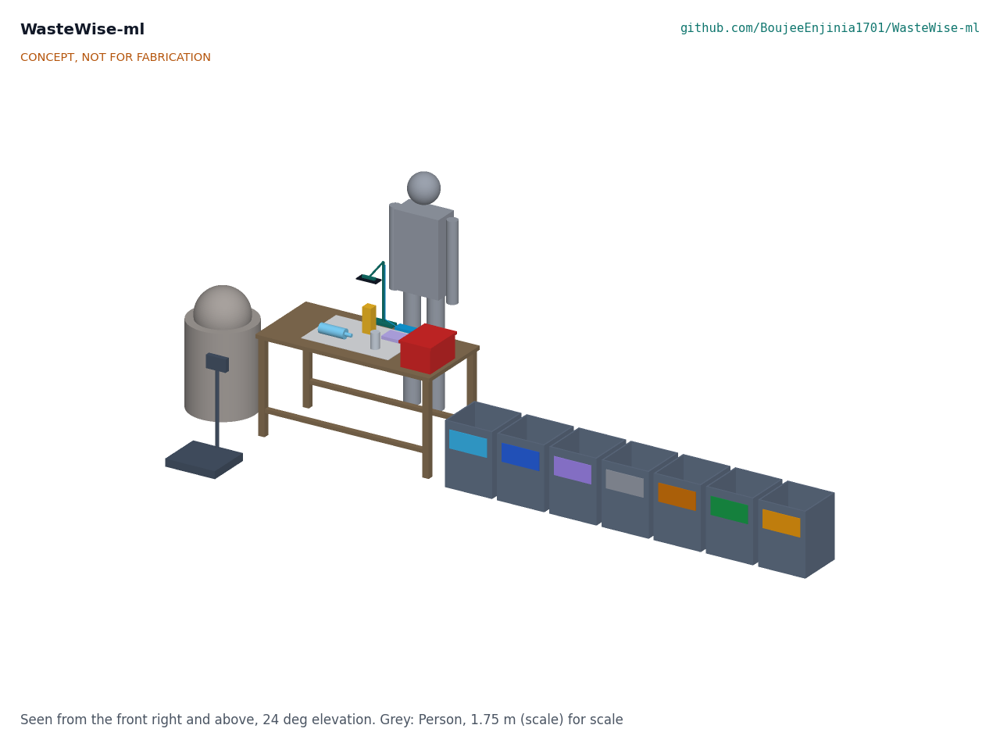
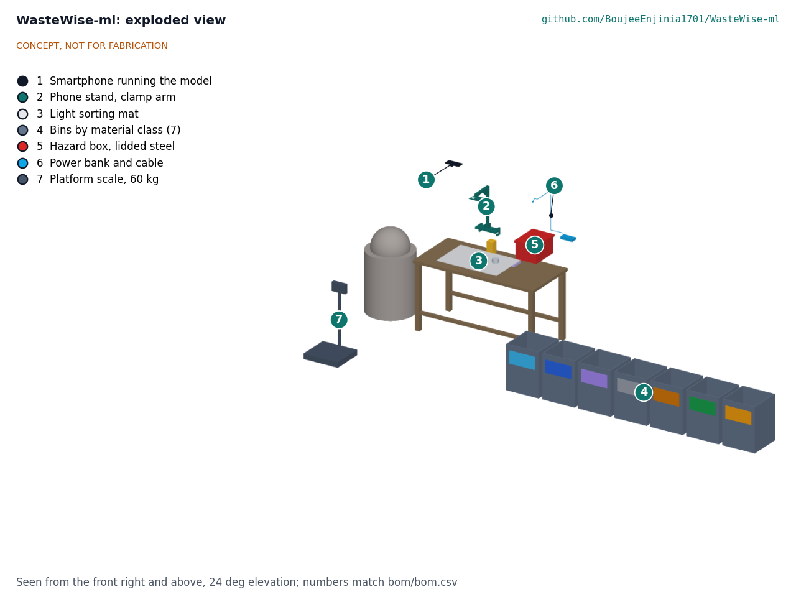
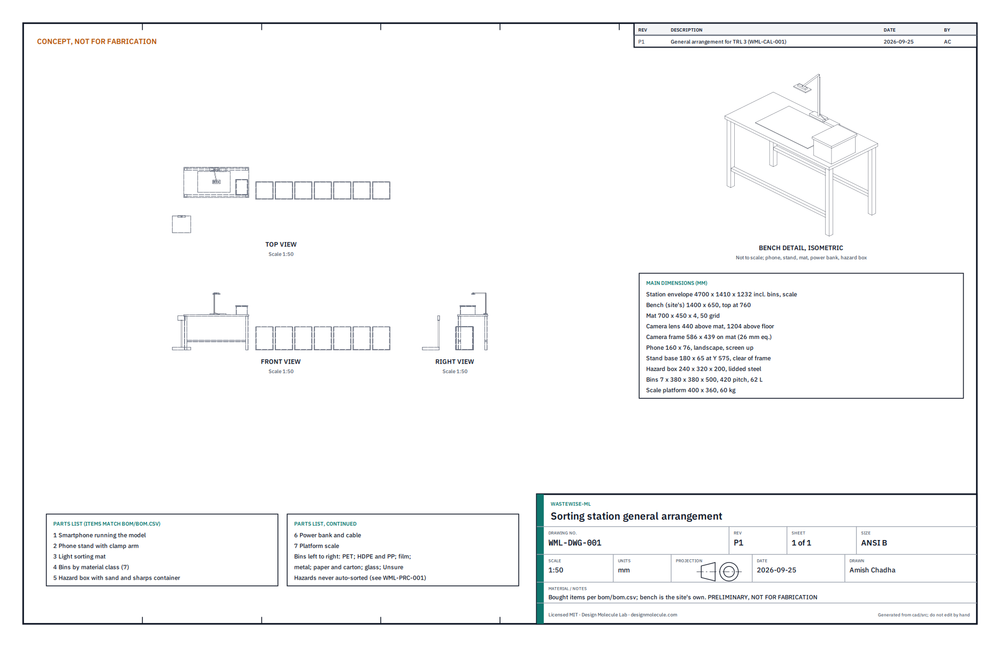

# WasteWise-ml design precis

WasteWise-ml is an open image classifier that runs offline on a low-cost Android phone. The user photographs one item on a light mat, and within a fraction of a second the phone shows the item's material class, its local buyer grade and a confidence value, or says "Unsure" or "Hazard". Sorted material goes to bins that match the buyer's price list; unsure plastics go to WasteWise Scan for a near-infrared (NIR) resin check; clean PET, HDPE and PP can be sold to a ReflowEconomy micro-factory. The calculation note WML-CAL-001 finds that a MobileNetV3-Large model of about 4.4 MB answers in 64 to 201 ms on a low-cost phone and uses about 8 % of the battery in an 8 h shift of 500 scans, provided the screen sleeps between scans. The binding constraints are data and evaluation: about 10,000 field photos organized by buyer grade are needed, coverage is estimated at 68 % against a 70 % target, and a camera alone cannot separate some resins.

*Figure 1. Data and material flow at one sorting station. Teal: material and decisions; blue: linked WasteWise Scan and ReflowEconomy steps; red: hazards; dashed: the data loop. Percentages are estimates for a dry mixed stream (WML-CAL-001, section 8).*

*Figure 2. The concept in its setting, generated from the parametric model `cad/src/model.py`: a sorting bench with a phone on a clamp stand over a light mat, sample items (PET bottle, can, carton and film), seven color-labeled bins by material class, a hazard box and a platform scale. The grey figure is a 1.75 m person for scale.*

## How it works

1. **Present.** The picker takes one item from the input sack and holds or places it on a light mat under the phone. On the floor or in the street the phone is handheld instead.
2. **Photograph.** A tap, or a foot switch in a later version, takes one photo. The app crops and resizes it to 224 x 224 pixels. The camera does not run between scans and the screen sleeps until the next tap, which is what keeps the battery within R10 (see "Battery").
3. **Classify.** A mobile convolutional network with one shared backbone and two small output heads runs on the phone with no network. The first head predicts one of seven material classes; the second predicts the grade within that class (about 22 grades, listed in `ml/data/taxonomy.yaml`).
4. **Decide.** The app compares the confidence with per-class thresholds.
   - Confident: it shows an icon, a color and a bin number, and optionally speaks the grade in the local language.
   - Below threshold: it shows "Unsure: check". The item goes to the Unsure bin, and later to WasteWise Scan (for plastics) or the picker's own judgment.
   - Any hazard class above a low threshold: it shows "Hazard: do not sort" in red. The item goes to the hazard box. Hazards are never offered as a sortable grade.
5. **Map to local grades.** A per-site configuration file maps the model's grades to the buyer's grade names, bin numbers and colors, so a new city needs a new file, not a new model, unless it pays for a grade the model cannot see.
6. **Sell.** Sorted lots are weighed and sold at the grade price. Clean PET, HDPE and PP can go to a ReflowEconomy micro-factory.
7. **Learn.** With the user's consent, photos of unsure and corrected items are queued and uploaded when a network is available. The partner organization checks labels, and the project retrains, evaluates on a fixed field test set and publishes new weights with a model card.

## Main components

Numbers 1 to 7 match the exploded view (Figure 3) and `bom/bom.csv`. Items 8 to 10 are effort and compute, with no geometry.

| No. | Component | Role |
| --- | --- | --- |
| 1 | Smartphone running the model | Camera, compute and display; the user's own phone or a reference phone (about 3 GB RAM, 2019 or later chipset) |
| 2 | Phone stand with clamp arm | Holds the phone landscape, screen up, with the rear camera 440 mm above the mat so both hands stay free and the view is repeatable; the base sits behind the mat, outside the picture |
| 3 | Light sorting mat | Plain, matte 700 x 450 mm background with a 50 mm grid for scale; the camera frame (586 x 439 mm) fits inside it; assumed to help accuracy |
| 4 | Bins by material class (7) | About 60 L each: PET; HDPE and PP; film; metal; paper and carton; glass; Unsure |
| 5 | Hazard box | Lidded steel box with a sand layer and a sharps container inside |
| 6 | Power bank and cable | Keeps the phone running through a shift |
| 7 | Platform scale | Weighs sorted lots before sale |
| 8 | Labeled field dataset | About 10,000 consented photos labeled by class and grade |
| 9 | Field evaluation set | About 2,000 photos with verified ground truth, never used for training |
| 10 | Training compute | About 40 GPU hours of fine-tuning and evaluation |

*Figure 3. Exploded view of one sorting station with numbered callouts matching the BOM. The bench, input sack and sample items belong to the site and carry no number.*

The software itself has four parts, all MIT licensed:

- **Taxonomy** (`ml/data/taxonomy.yaml`): material class, then grade, aligned to resin identification codes and to common buyer grades.
- **Model**: an ImageNet-pretrained MobileNetV3-Large backbone (decided, WML-DDR-001 D2) fine-tuned on public and field images, with a class head and a grade head. Exported as an 8-bit TensorFlow Lite model and as ONNX, attached to GitHub Releases (`ml/models/README.md`).
- **Site configuration**: a small file per site that maps grades to buyer names, bin numbers, colors and voice prompts.
- **Data manifests** (`ml/data/SOURCES.md`): each source with its license, use and consent basis. Images are referenced, not committed.

## First-order numbers

All values below are from WML-CAL-001 and its script `docs/04-calcs/sizing.py`. They are calculations on stated assumptions, not measurements; nothing has been trained.

### Model size and speed

- **Size.** MobileNetV3-Large has 5.4 million parameters including its 1,000-class ImageNet classifier (TensorFlow Models, MobileNet README). Replacing that classifier with a 7-output class head and a 22-output grade head leaves 4.16 million parameters: **4.4 MB** in 8-bit form, 8.7 MB in float16 and 17.5 MB in float32. R6 (10 MB) needs the 8-bit or float16 export.
- **Speed.** Scaling the published 44 ms on a Pixel 1 large core by 1 to 4 for a low-cost phone, and cross-checking against the throughput of one Cortex-A53-class core, gives 44 to 181 ms of inference. With 20 ms of preprocessing the photo-to-result time is **64 to 201 ms**, within R5 (0.3 s).
- **Fallback.** MobileNetV3-Small (2.9 million parameters, about 15 ms on a Pixel 1 in 8-bit form) remains the fallback for very old phones.

### Battery

- A 4,000 mAh battery at 3.85 V holds 15.4 Wh. One scan (3 s of screen, camera and processor at about 2.5 W) is 7.5 J; the model itself is 0.09 to 0.35 J of that.
- **Tap-to-scan with the screen asleep between scans:** about 1.3 Wh per 8 h shift of 500 scans, **8 %** of the battery. R10 is met.
- **Screen on all shift:** about 7.9 Wh, 51 %. R10 is met only with the power bank (item 6), which puts about 26.7 Wh into the phone, 3.4 such shifts.
- **Live preview all shift:** about 20 Wh, 130 %. Not used (decided, D5).

### Camera at the station

With a 26 mm-equivalent main camera 440 mm above the mat, the phone sees 586 x 439 mm, inside the 700 x 450 mm mat, and the stand base stays 20 mm outside the picture. At full 12 MP resolution a pixel is 0.15 mm on the mat, fine enough for a molded resin code; the app crops to the item before resizing to 224 px (1.3 mm per pixel for a 300 mm item). At the TRL 2 height of 470 mm the frame would overhang the mat, so the model uses 440 mm (proposed, WML-DDR-001 N3).

### Data needed

- **Training.** On an assumed learning curve for fine-tuning, 90 % accuracy on answered items at 70 % coverage needs about 230 images per label (128 to 591 across the sensitivity cases). The design figure is 300 per grade, doubled for eight hard grades, with 10 % rejected: **about 10,000 field photos**. The four hazardous grades need about 2,400 photos, far more than the 300 a natural stream would give, so hazards are photographed on purpose.
- **Labeling effort.** At about 20 s per photo plus 30 % for review, 10,000 photos take about 72 h. The field evaluation set of 2,000 photos, with ground truth verified by a buyer, a legible resin code or an NIR reading at about 60 s each plus review, takes about 43 h.
- **Cost.** At the $6 per hour planning rate (the real rate is set with the partner at or above the local living wage, D7), the dataset and evaluation set cost about $690 ($433 and $260, entered in the BOM as $430 and $260), plus $40 of cloud compute. See `bom/bom.csv`.

### Share of items answered

On an assumed dry mixed stream, about 9 % of items are opaque HDPE or PP or black plastics that a camera cannot grade. With the remaining items thresholded for 90 % grade accuracy, the app answers about **65 % with a grade, 32 % "Unsure" and 3 % hazard**. That is 68 % answered, 2 points under R4. The hazard box receives about 4.9 % of items, 40 % of them false alarms, which is the intended trade for high hazard recall.

### Evaluation

Hazard recall is proved with a one-sided 95 % lower bound. With 200 hazard items the model must miss none to show 98 %; with 400 it may miss up to 3. The 2,000-image field set therefore holds 400 hazards, at least 50 of each non-hazard grade (900) and 700 in the natural mix (decided, WML-DDR-001 N1). Its accuracy estimate for R1 is good to about +/- 1.8 points.

### Value to the picker

The benefit is the price difference between a sorted grade and mixed material, times the mass that moves up a grade. No local price list has been collected yet, so no figure is claimed here. The first co-design sessions should record the buyer's price list and the mass a picker sorts per day, so the benefit can be estimated before any field trial.

### Pilot cost (reference only)

One station (items 1 to 7) is $285 in indicative prices; a two-station pilot with dataset, evaluation set and compute is $1,300. This repository has no hardware budget; these figures are for planning only.

*Figure 4. General arrangement of the sorting station, drawing WML-DWG-001 Rev P1, generated from `cad/src/model.py`. Preliminary, not for fabrication.*

## Key design choices

Choices 1 to 4 and 6 to 8 were decided by Amish on 2026-09-25, going with the recommendations (WML-DDR-001, D1 to D8). Choice 5 was not a separate review item; it follows from R2 and remains the design basis.

1. **Single item on a mat, not detection in a pile (D1).** Classifying one centered item is simpler, needs image-level labels only and fits a sorting bench. Detecting many items in a pile (a TACO-style detector) is kept as a later option.
2. **Mobile classifier on the phone, not a cloud service (D2).** Works offline, costs nothing per scan and keeps photos on the device unless the user shares them.
3. **Two heads: class, then grade (D2).** A wrong grade within the right class costs less than a wrong class, and the class head can be trusted when the grade head is not.
4. **Abstain rather than guess (D3).** "Unsure" is a normal answer with its own bin. It protects the picker's reputation with the buyer.
5. **Camera for shape and label; NIR for resin.** A photo sees shape, color, print and texture, which identify PET bottles, cans, cartons and cardboard well. It cannot reliably separate opaque HDPE from PP or identify black plastics. Those go to WasteWise Scan.
6. **Grades set per site in a file (D4).** Buyers' grade names and prices differ by city.
7. **Hazards are flagged, never sorted (D3).** The hazard class is tuned for high recall even at the cost of false alarms.
8. **Data owned with the pickers (D6).** Field photos are collected with consent and opt-in upload, contain no faces, and the pickers' organization co-owns the field dataset.

## Safety

> **Safety:** WasteWise-ml guides sorting; it does not make any item safe to handle and does not certify material. The sorting station has sharp, chemical, biological and fire hazards, and a wrong answer can put a hazardous item in the wrong place.

- **Sharps and broken glass.** Cut-resistant gloves are the norm at the station. The app must never ask the user to hold an item closer or turn it by hand for a better photo; the mat and stand let the item lie still.
- **Lithium cells.** Loose cells and devices with batteries can ignite when crushed, punctured or baled. Any battery or electronic item goes to the lidded steel hazard box with a sand layer, away from paper and film. The hazard class is tuned for high recall (R3), and a hazard result can never be overridden into a sortable grade in the app.
- **Chemical and medical waste.** Containers with residues, aerosol cans, syringes and medical waste are flagged as hazards. Disposal routes are agreed with the partner and the municipality; the app does not advise on disposal.
- **Misclassification.** The model will be wrong on some items. Grades are advice, the "Unsure" route is normal, and the buyer's check remains the final grade. The model card will publish per-class error rates.
- **Power bank and phone.** Both contain lithium cells: keep them shaded, off hot metal and away from the hazard box; do not charge a swollen or damaged pack.
- **Collecting hazard photos.** Hazard photos for training and evaluation are taken where the item lies, or with sharps inside a rigid container or held with tongs, by people trained for it. Pickers are never asked to collect or handle hazards for the dataset.
- **Privacy.** Photos must not include faces or identify people; upload is opt-in; the data protocol is agreed with the partner before any collection.
- **Heat and ergonomics.** A phone in direct sun overheats and throttles; the stand should sit in shade. Bench height and bin placement should be set with the users to avoid repeated bending.

## Open questions

Paper answers from WML-CAL-001 are given where it has one; the rest need field data, which is TRL 4 work and on hold.

- Which partner organization, city and buyers first? Proposed, awaiting Amish (WML-DDR-001 O1).
- How much does the light mat help versus a handheld photo on a mixed background? Needs field data.
- Which grades matter most to the first buyer, and which are visible in a photo at all? Needs the first co-design sessions.
- What confidence thresholds give 70 % or more coverage while meeting R1 and R3? On paper about 68 %; set from the field evaluation set.
- How should the app handle crushed, wet or dirty items, and labels that lie about the contents?
- Dataset licenses: TrashNet and TACO are usable with checks; ZeroWaste (CC BY-NC 4.0) is excluded from training (decided, N2). Per-image checks on TACO remain.
- The hazard evaluation size of 400 items (N1) and the 440 mm camera height (N3) were decided by Amish on 2026-09-25 (WML-DDR-002).

## References

- Bashkirova, D., et al. 2022. "ZeroWaste Dataset: Towards Deformable Object Segmentation in Cluttered Scenes." *Proceedings of the IEEE/CVF Conference on Computer Vision and Pattern Recognition (CVPR)*. arXiv:2106.02740. Dataset CC BY-NC 4.0: https://github.com/dbash/zerowaste.
- Howard, A., et al. 2019. "Searching for MobileNetV3." *Proceedings of the IEEE/CVF International Conference on Computer Vision (ICCV)*. arXiv:1905.02244.
- Kaza, S., L. Yao, P. Bhada-Tata and F. Van Woerden. 2018. *What a Waste 2.0: A Global Snapshot of Solid Waste Management to 2050.* Washington, DC: World Bank. https://openknowledge.worldbank.org/handle/10986/30317; figures checked at https://datatopics.worldbank.org/what-a-waste/.
- Lau, W. W. Y., et al. 2020. "Evaluating Scenarios toward Zero Plastic Pollution." *Science* 369 (6510): 1455 to 1461. https://doi.org/10.1126/science.aba9475. The 58 % informal-sector share was checked in the accepted manuscript.
- Proença, P. F., and P. Simões. 2020. "TACO: Trash Annotations in Context for Litter Detection." arXiv:2003.06975. Dataset and code: https://github.com/pedropro/TACO.
- Tan, M., and Q. V. Le. 2019. "EfficientNet: Rethinking Model Scaling for Convolutional Neural Networks." *Proceedings of the 36th International Conference on Machine Learning (ICML)*, PMLR 97: 6105 to 6114.
- TensorFlow Models. "MobileNet" README, MobileNetV3 checkpoint table. https://github.com/tensorflow/models/tree/master/research/slim/nets/mobilenet.
- Thung, G., and M. Yang. 2016. "Classification of Trash for Recyclability Status." CS 229 project report, Stanford University. Dataset: https://github.com/garythung/trashnet.
- WIEGO (Women in Informal Employment: Globalizing and Organizing). "Waste Pickers." Occupational group page. https://www.wiego.org/informal-economy/occupational-groups/waste-pickers/.
