# WasteWise-ml scanning rig build plan

**Plan, not yet built.** How to build the first proof-of-concept scanning rig, component by component. Building and testing to it is TRL 4 work. Decisions still to be made are kept in the design decisions register ([docs/06-design-decisions.md](06-design-decisions.md)), not here.

WasteWise-ml is software: an image classifier that runs on a phone. Its prototype hardware is the scanning rig that holds the phone over the sorting mat, and that rig is what this plan builds. The bins, hazard box and platform scale of the sorting station are bought and set out as the general arrangement drawing shows; they need no making.

## 1. What you are building

*Figure 1. Every component of the scanning rig pulled apart and numbered in build order: 1 to 7 are made, 8 to 10 are bought.*

The rig is a small stand clamped to the back edge of a sorting bench. A plywood base board carries a square aluminium post; an arm of the same tube reaches forward from the top of the post and holds a folded aluminium tray, and the phone lies in the tray screen up with its camera looking straight down through a window, 440 mm above a painted sorting mat. The mat lies on the bench against the front edge of the base board, which places it so that the camera's picture falls on the mat and the stand stays out of the picture. A power bank on the bench feeds the phone through a cable that runs up the post and along the arm. Figure 1 shows the 10 components in the order you make or fit them. Seven are made in a home workshop: the base board, two foot angles, the post, the arm, two corner plates, the phone tray and the mat. Three are bought: two G-clamps, the phone, and the power bank with its cable. The work is sawing and drilling aluminium tube, angle and plate, cutting and folding a small piece of aluminium sheet, cutting plywood and hardboard, and painting. The rig's stock, paint and fixings cost about $44, and the whole station about $309 with the phone, from the bill of materials.

> **Safety:** Cut aluminium edges and the corners of the folded tray are sharp: deburr everything and wear gloves when handling stock. The phone and power bank contain lithium cells: keep them shaded, off hot metal and away from the hazard box, and never charge a swollen or damaged pack. At the sorting station the rig is used beside sharps, broken glass and chemical containers: the app never asks anyone to hold an item closer to the camera, and hazards go to the hazard box, never under the phone by hand.

## 2. What changed to make it buildable

The concept showed what the rig does; its stand could not be built as drawn. Each change below keeps what the rig does (the phone landscape and screen up, its camera 440 mm straight above the centre of the 700 x 450 mm mat, the stand out of the picture), and all of them are recorded in decision record WML-DDR-003, open for Amish's review.

*Table 1. Changes from the concept.*

| Component | The concept had | The buildable design has | Why |
| --- | --- | --- | --- |
| Base | A 180 x 65 mm weighted base standing free behind the mat | A plywood board 240 x 90 x 18 mm clamped to the bench's back edge with two G-clamps (Figure 16) | The free base would tip forward under the phone's weight; a clamped board cannot |
| Phone holder | A clamp whose jaws missed the phone, with a bar across the screen | A folded tray: the phone lies in it screen up, its camera bump in a window (Figures 10 and 12) | Nothing covers the screen or presses on the phone, and it lifts out in one move |
| Post and arm | Round rods meeting with no fixing; the arm reached over the screen | Square aluminium tube, the arm butting the post and held by two bolted corner plates; the arm ends beside the phone (Figure 8) | Every joint is flat and bolted, and the screen is clear |
| Post foot | No fixing | Two foot angles, bolted to the post and screwed to the board (Figure 4) | The post stays upright when someone leans on it |
| Cable | Ran through the stand | Up the post's back face and along the arm top, held by cable ties; a 1.5 m cable (step 8) | Clear of every part and out of the picture |
| Mat position | The base stood 15 mm behind the mat with nothing to place the mat | The mat's back edge meets the board's front edge, centre mark to centre mark (Figures 14 and 15) | One push puts the picture on the mat every time |

## 3. Making the components

Make and check each component before the assembly step that needs it. Sizes are in millimetres. "Front" is the side of the stand that faces the mat; "left" and "right" are as seen standing at the far side of the bench, looking at the front of the stand. Workshop tolerance is 0.5 mm unless a step says otherwise; drawings do not carry tolerances before TRL 4.

### 3.1 Base board

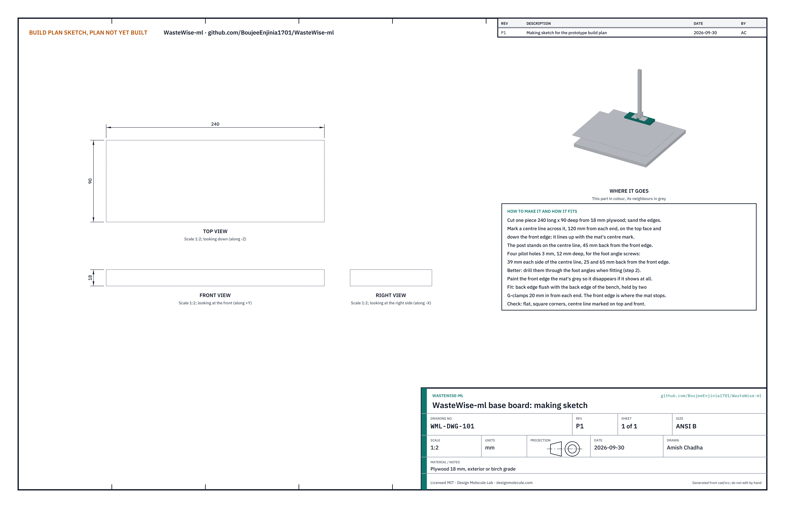

*Figure 2. Base board making sketch (WML-DWG-101).*

**What it is and what it is made from.** The board the post stands on and that clamps to the bench. Plywood 18 mm thick, exterior or birch grade.

**How to make it.**

1. Cut one piece 240 long and 90 deep. Sand the edges.
2. Mark a centre line across the board 120 from each end, on the top face, and carry it down the front edge as a short pencil line. This is the centre mark the mat lines up with.
3. Mark where the post stands: on the centre line, its front face 32.5 back from the front edge (its centre 45 back).
4. Paint the front edge the mat's grey, so that it disappears if it ever shows at the edge of the picture.
5. The four screw holes are drilled through the foot angles when the post is fitted (step 2), so they line up.

**How it fits the parts next to it.** The foot angles sit flat on its top face either side of the post (Figure 4). Its back edge is flush with the back edge of the bench, and two G-clamps, 20 in from each end, hold it down (Figure 16). Its front edge is where the mat stops (Figure 15).

**Check before moving on.** The board lies flat on the bench without rocking; the centre line is marked on the top and on the front edge.

### 3.2 Foot angles (make 2)

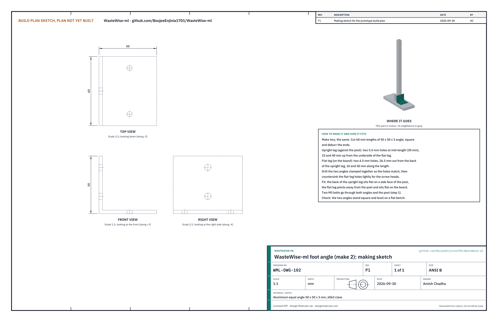

*Figure 3. Foot angle making sketch (WML-DWG-102).*

**What it is and what it is made from.** Two short angles that hold the foot of the post on the board, one each side. Aluminium equal angle 50 x 50 x 3 mm, 6063 class.

**How to make it.**

1. Cut two 60 lengths. Square and deburr the ends.
2. Upright leg: two 5.5 holes at mid-length (30 from either end), 15 and 40 up from the underside of the flat leg.
3. Flat leg: two 4.5 holes, 26.5 out from the back of the upright leg, 10 and 50 along the length.
4. Clamp the two angles together and drill them as a pair so the holes match. Countersink the flat-leg holes lightly for the screw heads.

**How it fits the parts next to it.**

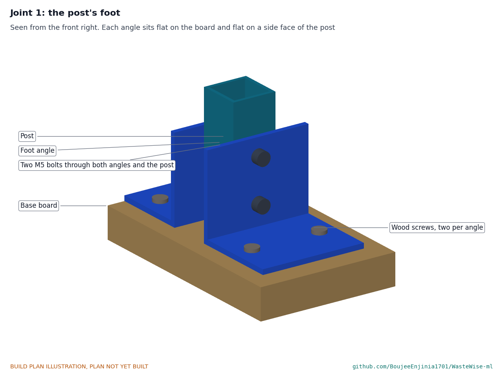

*Figure 4. The back of each upright leg sits flat on a side face of the post; each flat leg sits flat on the board and points away from the post.*

The two angles stand back to back with the post between them. Two M5 x 40 bolts pass through both upright legs and the post, with a washer under each head and nut and nyloc nuts. Two wood screws through each flat leg go into the board.

**Check before moving on.** Each angle stands square and steady on a flat bench; the bolt holes of the two angles line up when they are held back to back with a 25 spacer between them.

### 3.3 Post

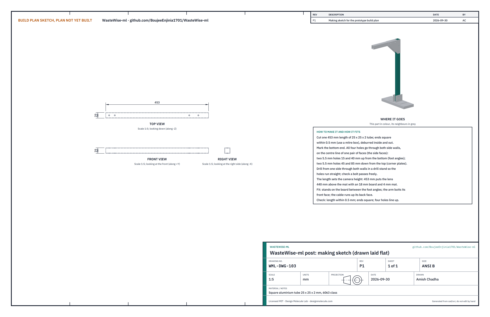

*Figure 5. Post making sketch (WML-DWG-103).*

**What it is and what it is made from.** The upright that carries the arm. Square aluminium tube 25 x 25 x 2 mm, 6063 class.

**How to make it.**

1. Cut one 453 length in a mitre box so both ends are square. Deburr inside and out. This length sets the camera height: with the 18 board and the 4 mat, it puts the lens 440 above the mat.
2. Mark the bottom end. Choose one pair of opposite faces as the side faces.
3. Drill four 5.5 holes across the side faces, through both walls, on their centre line: 15 and 40 up from the bottom (foot angles), and 45 and 85 down from the top (corner plates). Use a drill stand so each hole runs straight through both walls.

**How it fits the parts next to it.** It stands on the board between the foot angles (Figure 4). The arm butts its front face and the corner plates bolt across its side faces at the top (Figure 8). The cable runs up its back face.

**Check before moving on.** Length 453, within 0.5; both ends square; an M5 bolt passes freely through each pair of holes.

### 3.4 Arm

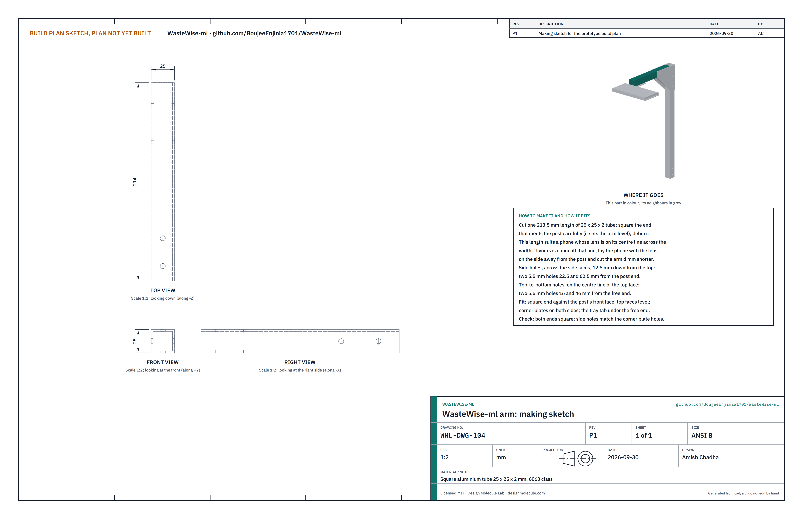

*Figure 6. Arm making sketch (WML-DWG-104).*

**What it is and what it is made from.** The level tube that reaches from the post to the phone tray. Square aluminium tube 25 x 25 x 2 mm, 6063 class.

**How to make it.**

1. Before cutting, look at the phone the rig is for. The arm's length of 213.5 puts the lens over the centre of the mat for a phone whose lens is on its centre line across its width. Most phones have the lens nearer one long edge: measure how far the middle of the lens is from the phone's centre line across its width (call it d). The phone will lie with its lens on the side away from the post, so cut the arm d shorter than 213.5.
2. Cut the arm to that length. Square the end that meets the post carefully, since it sets the arm level. Deburr.
3. Side holes, across the side faces, 12.5 down from the top: two 5.5 holes, 22.5 and 62.5 from the post end.
4. Top-to-bottom holes, through the top and bottom faces on their centre line: two 5.5 holes, 16 and 46 from the free end.

**How it fits the parts next to it.** Its square end butts the post's front face with the tops level, and the corner plates bolt across both (Figure 8). The tray's tab lies flat under its free end, which stops 3 short of the tray's lip (Figure 11).

**Check before moving on.** Both ends square; held against the post with the corner plates, all four side holes line up.

### 3.5 Corner plates (make 2)

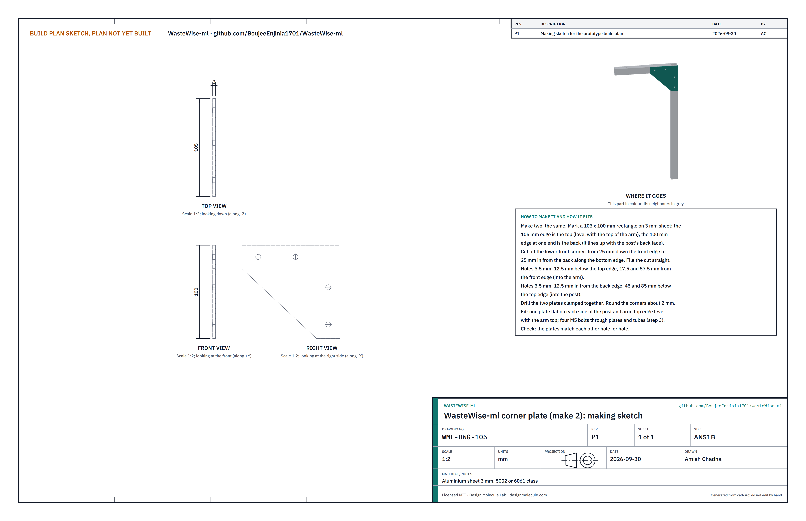

*Figure 7. Corner plate making sketch (WML-DWG-105).*

**What it is and what it is made from.** Two flat plates that join the arm to the post, one each side. Aluminium sheet 3 mm, 5052 or 6061 class.

**How to make it.**

1. Mark a 105 x 100 rectangle. The 105 edge is the top (level with the top of the arm); the 100 edge at one end is the back (in line with the post's back face).
2. Cut off the lower front corner in a straight line from a point 25 down the front edge to a point 25 in from the back along the bottom edge. File the cut straight and round all corners about 2.
3. Two 5.5 holes 12.5 below the top edge, 17.5 and 57.5 from the front edge (these go into the arm).
4. Two 5.5 holes 12.5 in from the back edge, 45 and 85 below the top edge (these go into the post).
5. Clamp the two plates together and drill them as a pair.

**How it fits the parts next to it.**

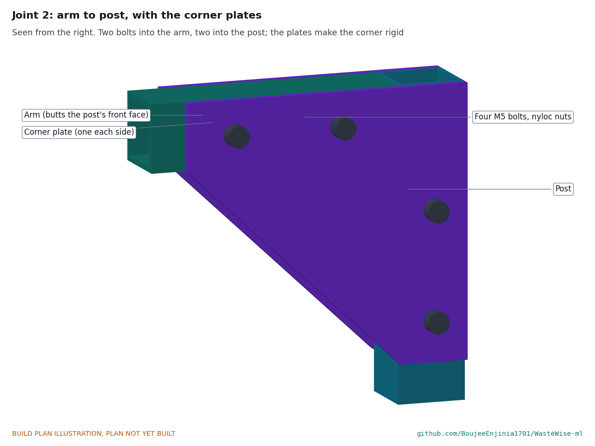

*Figure 8. One plate flat on each side of the post and the arm, top edges level with the arm top: two bolts into the arm, two into the post.*

Four M5 x 40 bolts pass through both plates and the tube between them, with a washer under each head and nut and nyloc nuts. The plates hold the arm square to the post; the arm's end bears on the post's front face.

**Check before moving on.** The two plates match hole for hole when laid one on the other.

### 3.6 Phone tray

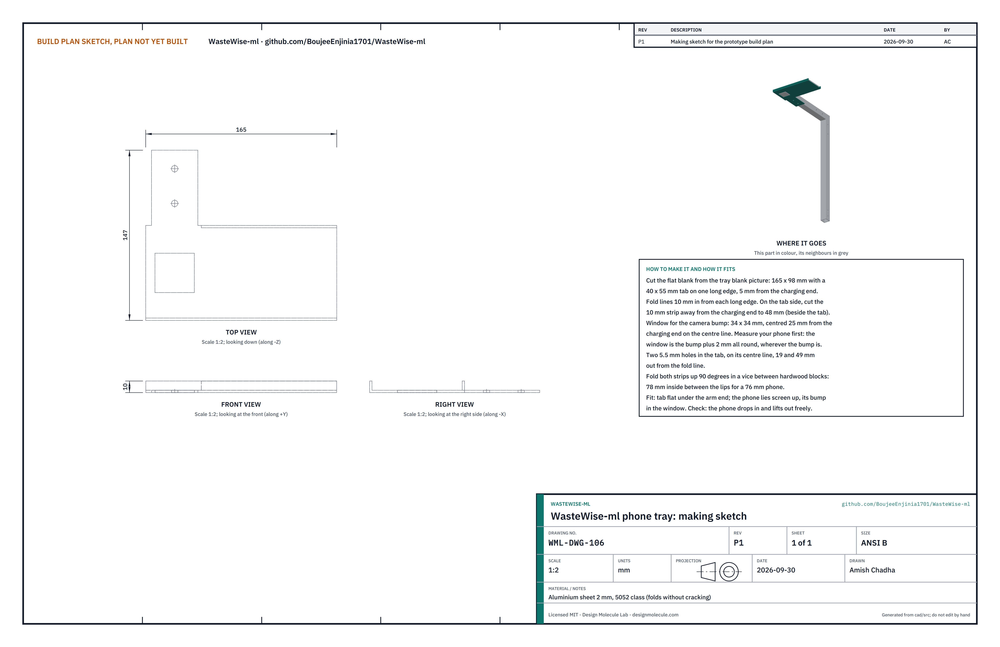

*Figure 9. Phone tray making sketch (WML-DWG-106).*

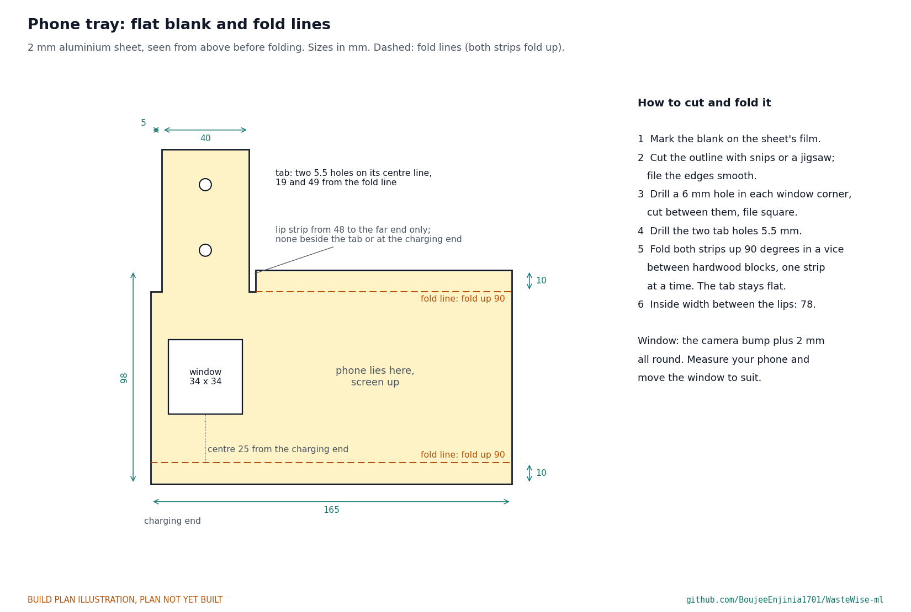

*Figure 10. The flat blank before folding, with its fold lines, window and tab.*

**What it is and what it is made from.** A shallow tray the phone lies in, screen up, with a window its camera looks through. Aluminium sheet 2 mm, 5052 class, which folds without cracking.

**How to make it.**

1. Measure the phone the rig is for: its width (the model assumes 76), the camera bump's size (the model assumes 30 x 30) and where the bump is. Move the window to sit round the bump with 2 to spare on every side, and set the tray's inside width to the phone's width plus 2.
2. Mark the blank from Figure 10 on the sheet's film: 165 long and 98 wide, with a tab 40 wide sticking out 55 beyond one long edge, 5 from the end that will be the phone's charging end. Fold lines run 10 in from each long edge; on the tab side, the 10 strip is cut away from the charging end to 48, so there is no strip beside the tab.
3. Cut the outline with aviation snips or a jigsaw with a metal blade. File every edge smooth and round the corners.
4. Window: 34 x 34, centred 25 from the charging end on the centre line (or wherever step 1 put it). Drill a 6 hole in each corner, cut between the holes and file the sides square.
5. Tab: two 5.5 holes on its centre line, 19 and 49 out from the fold line.
6. Fold each strip up 90° in a vice between hardwood blocks, one at a time. The tab stays flat. Inside width between the lips: 78.

**How it fits the parts next to it.**

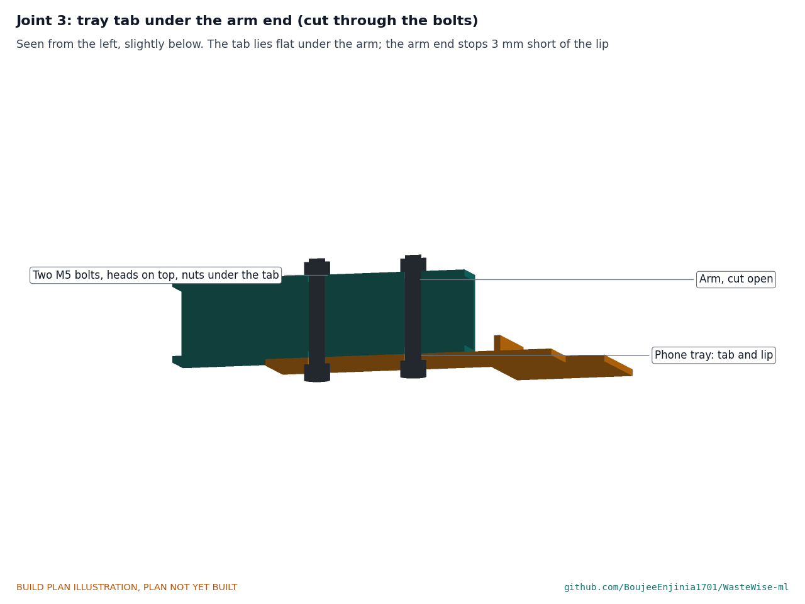

*Figure 11. The tab lies flat under the arm's free end, held by two M5 x 35 bolts with their heads on top of the arm and nyloc nuts under the tab.*

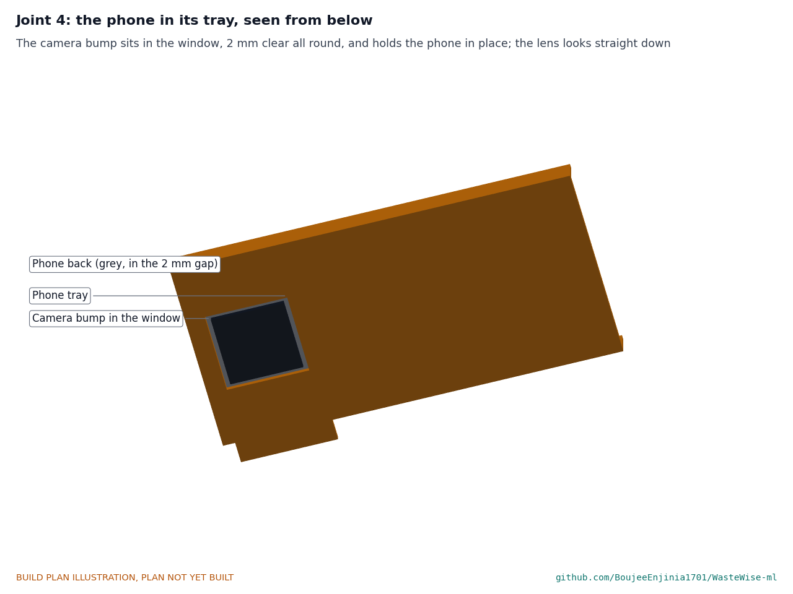

*Figure 12. The camera bump sits in the window with 2 clear all round; the phone's back rests on the tray and the lens is flush with the tray's underside.*

The phone lies screen up between the lips, its charging end level with the tray's open end so a plug fits. Nothing holds it but its own weight and the bump in the window, so it lifts straight out.

**Check before moving on.** The phone drops in and lifts out without force and does not rock; seen from below, the lens is centred in the window and nothing of the tray crosses it.

### 3.7 Sorting mat

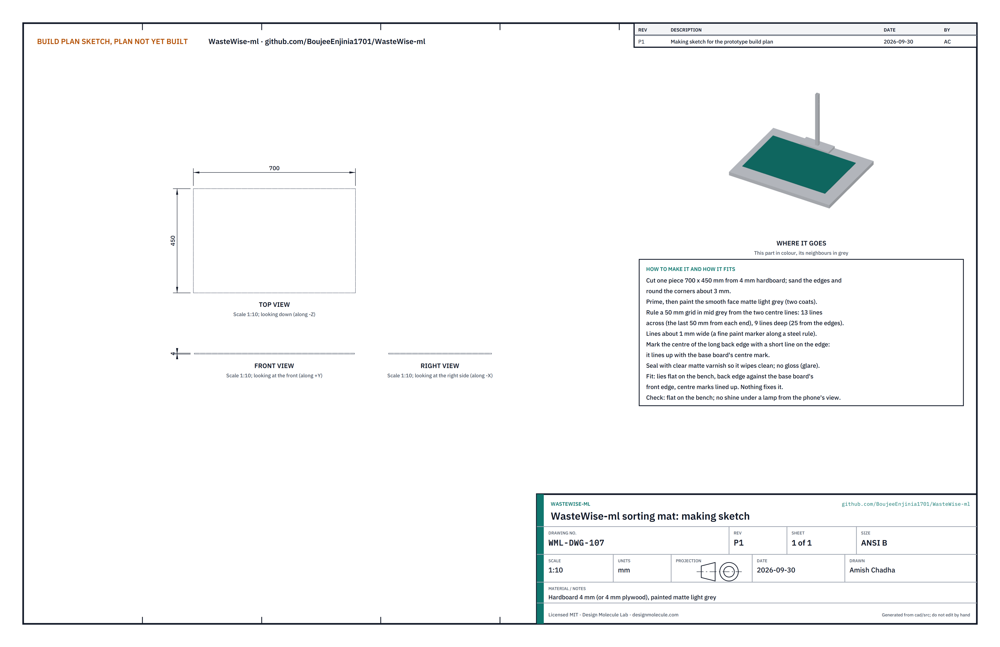

*Figure 13. Sorting mat making sketch (WML-DWG-107).*

**What it is and what it is made from.** The plain, matte surface items are photographed on, with a 50 grid for scale. Hardboard 4 mm (or 4 mm plywood), painted.

**How to make it.**

1. Cut one piece 700 x 450. Sand the edges and round the corners about 3.
2. Prime, then paint the smooth face matte light grey, two coats.
3. Rule a 50 grid in mid grey from the two centre lines: 13 lines across the width (the outer ones 50 from the ends) and 9 lines from front to back (the outer ones 25 from the edges). Lines about 1 wide, with a fine paint marker along a steel rule.
4. Mark the middle of one long edge with a short line across the edge: this is the back edge's centre mark.
5. Seal with clear matte varnish so it wipes clean. Never gloss: a shine shows in the photos as a bright patch.

**How it fits the parts next to it.**

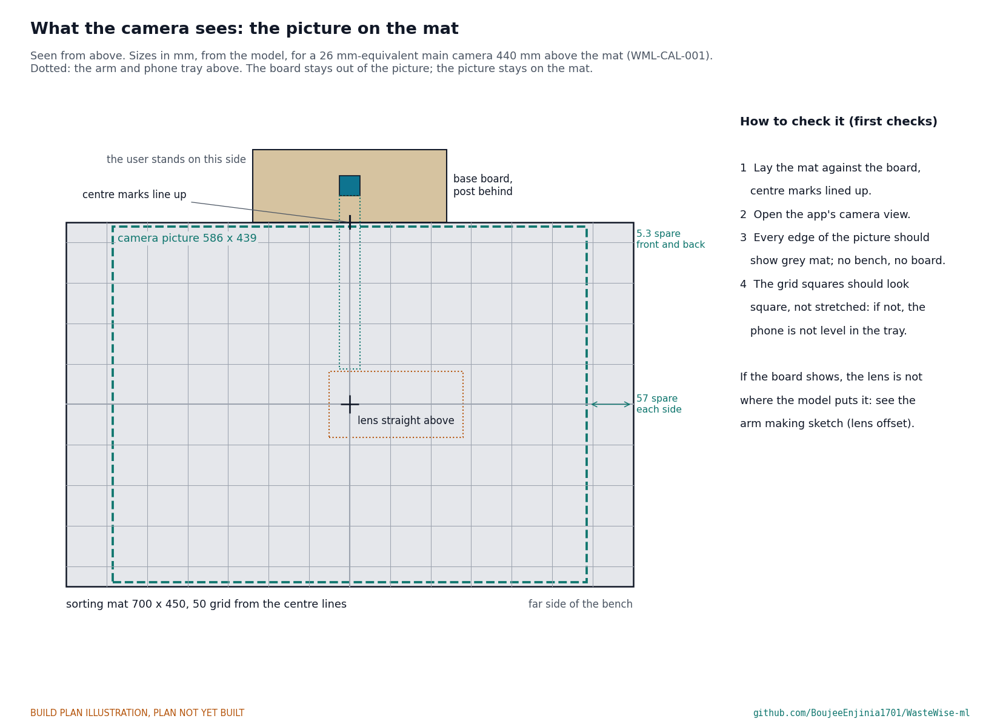

*Figure 14. Seen from above: the camera's picture, 586 x 439, lies inside the mat with 57 to spare at each end and 5.3 at the front and back.*

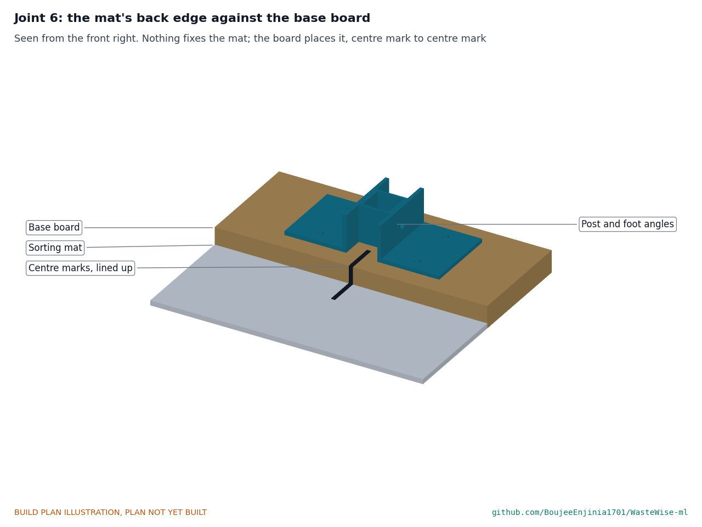

*Figure 15. The mat's back edge touches the board's front edge and the two centre marks line up. Nothing fixes the mat.*

**Check before moving on.** The mat lies flat on the bench; under a lamp, seen from where the phone will be, it shows no shine.

### 3.8 Bought components

Buy to specification, not brand. Line numbers are those of the bill of materials.

- **Phone (line 1).** Android phone, about 6 in screen, 3 GB RAM or more, 2019 or later chipset, 12 MP or better main camera, 4,000 mAh battery. The rig assumes a phone 160 x 76 x 9 with its camera bump on the back near one end; the tray window and the arm length are set to the phone actually bought (sections 3.4 and 3.6).
- **G-clamps (line 11).** Two 100 G-clamps with a throat of at least 50, to grip the board and the bench top together (Figure 16).
- **Power bank and cable (line 6).** 10,000 mAh USB power bank with over-current and over-temperature protection, and a 1.5 m USB cable to suit the phone. The run up the stand is about 0.93 m.
- **Fixings and finishes (line 11).** Stainless: 6 x M5 x 40 bolts and 2 x M5 x 35 bolts, each with two washers and a nyloc nut; 4 x No. 8 x 16 wood screws; 4 cable ties; primer, matte light grey and mid grey paint, clear matte varnish.

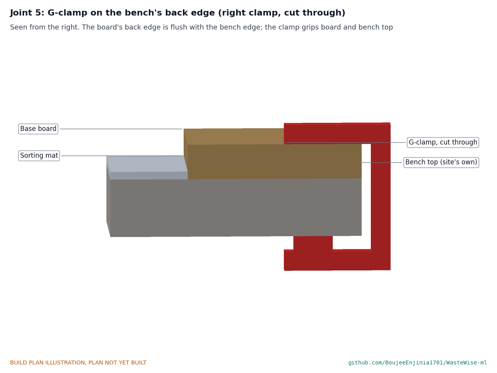

*Figure 16. Each clamp's upper jaw presses on the board and its screw pad on the underside of the bench top, just in from the bench's back edge.*

## 4. Putting it together

In each picture the parts already fitted are grey and the part being fitted is in colour, with an arrow showing the way it goes in. Use an 8 mm spanner and socket for the M5 nuts.

### Step 1: foot angles onto the post

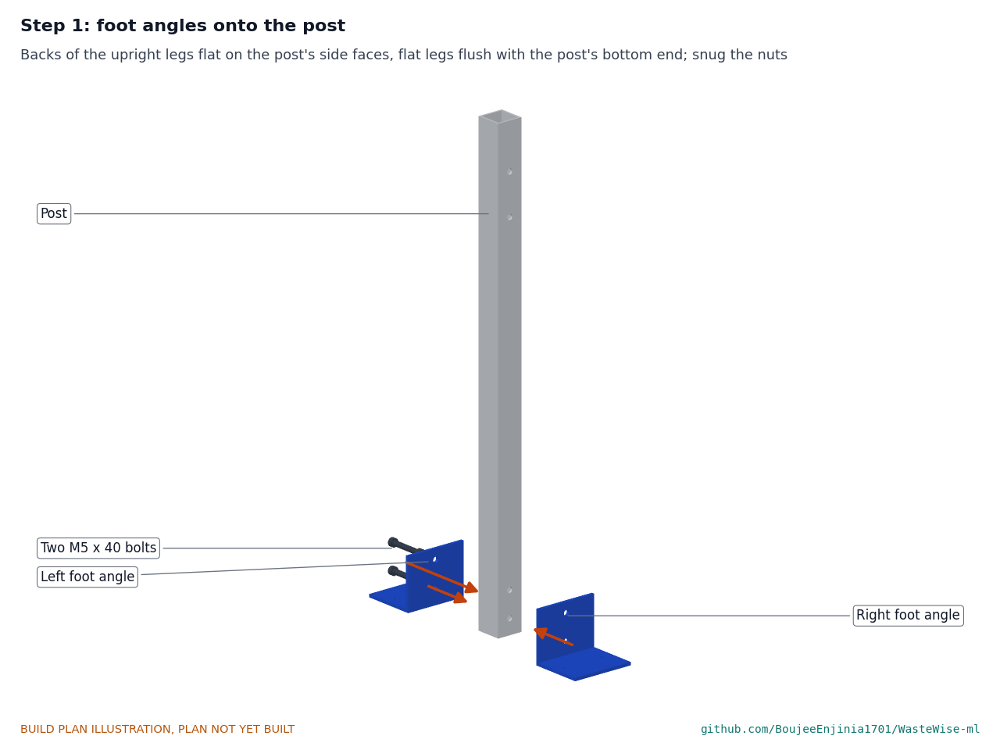

Hold the angles against the post's side faces with their flat legs flush with the post's bottom end. Two M5 x 40 bolts through both angles and the post; snug the nuts.

### Step 2: post onto the base board

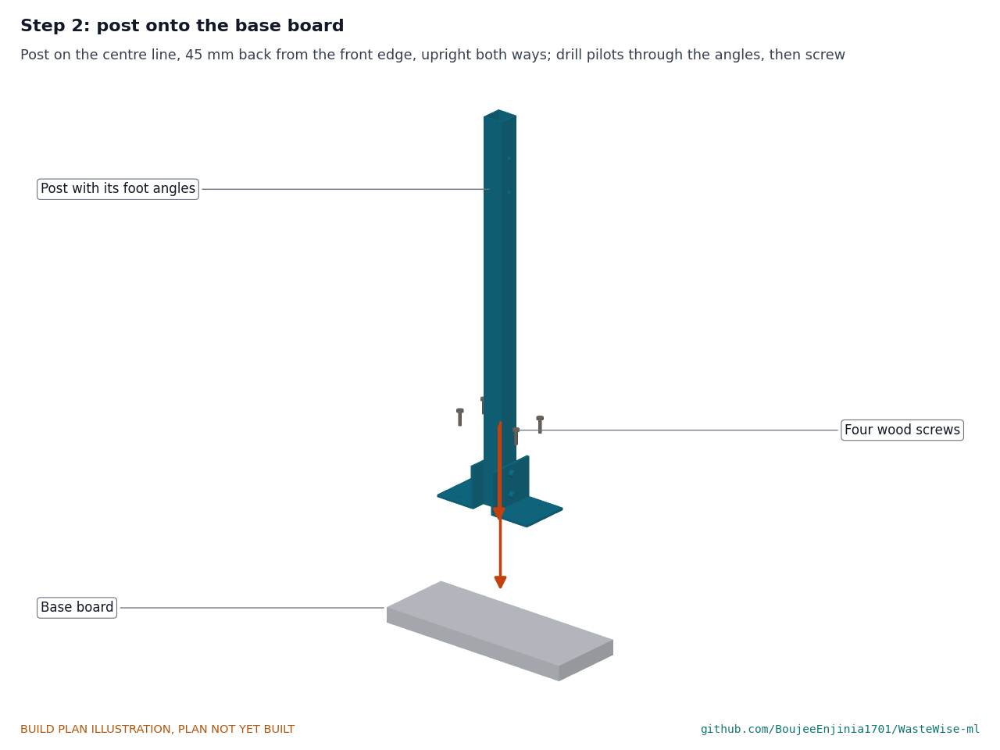

Stand the post on its mark on the board, centred on the centre line with its front face 32.5 back from the board's front edge. Check it is upright both ways with a spirit level. Drill 3 pilot holes 12 deep through the flat-leg holes, then fit the four wood screws. Tighten the two foot bolts.

### Step 3: arm and corner plates onto the post

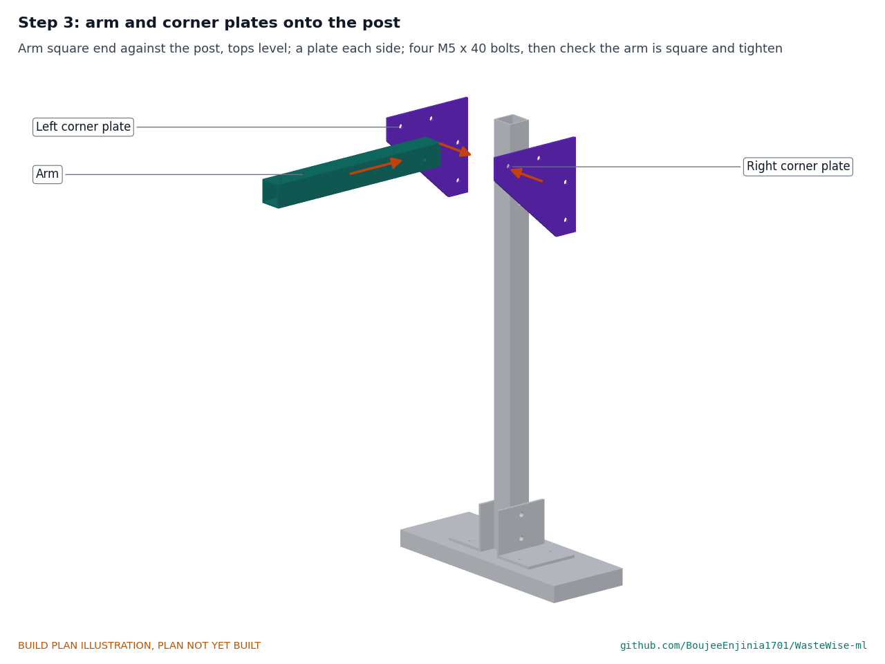

Hold the arm's square end against the post's front face, tops level. Fit a corner plate each side and the four M5 x 40 bolts, loosely. Check the arm is level and square to the post, then tighten all four.

### Step 4: phone tray onto the arm

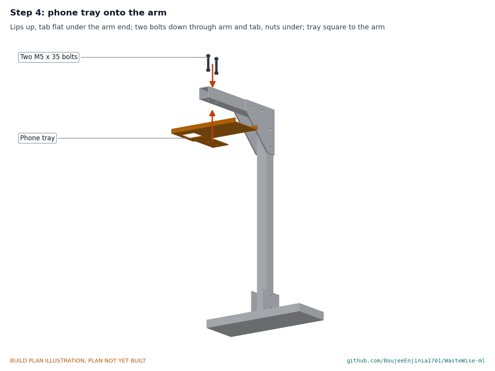

Lips up, slide the tab under the arm's free end until its holes line up with the arm's. Two M5 x 35 bolts down through the arm and the tab, nuts underneath. Check the tray is square to the arm before tightening.

### Step 5: stand onto the bench

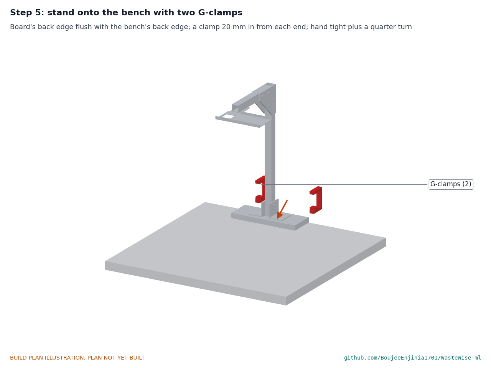

Set the board on the bench with its back edge flush with the bench's back edge and the post roughly central along the bench. Fit a G-clamp 20 in from each end of the board; hand tight, then a quarter turn. **Hold point:** push the tray end down and sideways by hand: nothing moves at any joint and the board does not shift.

### Step 6: sorting mat onto the bench

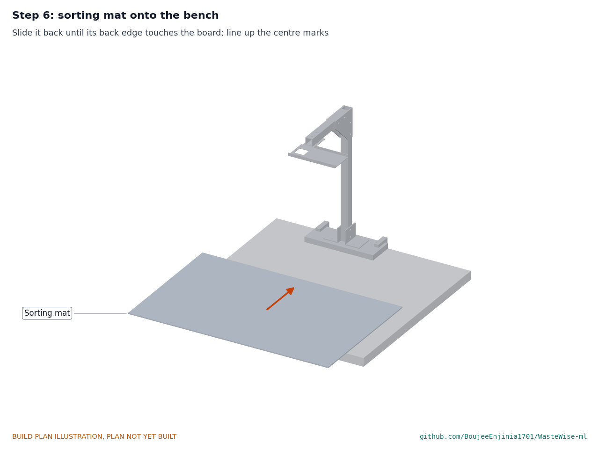

Lay the mat on the bench and slide it back until its back edge touches the board's front edge. Line up the two centre marks.

### Step 7: phone into the tray

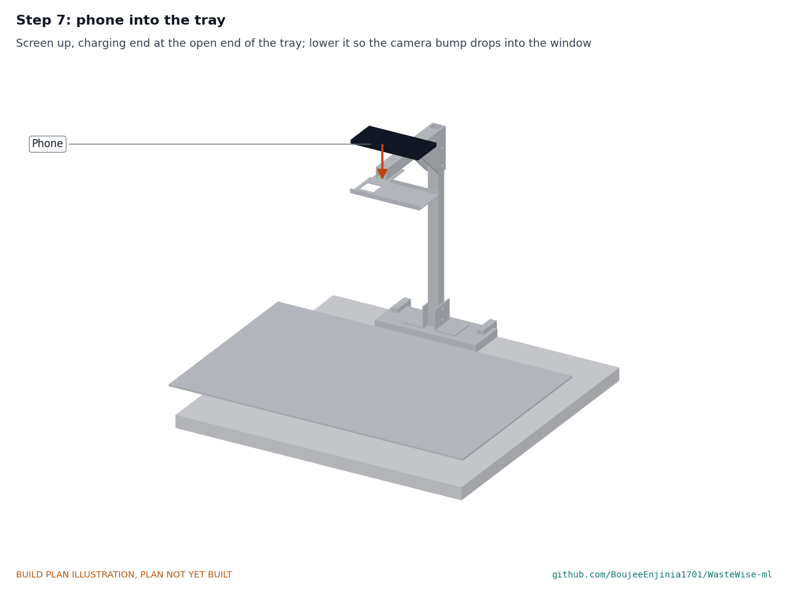

Screen up, charging end at the tray's open end, lower the phone so its camera bump drops into the window.

### Step 8: power bank and cable

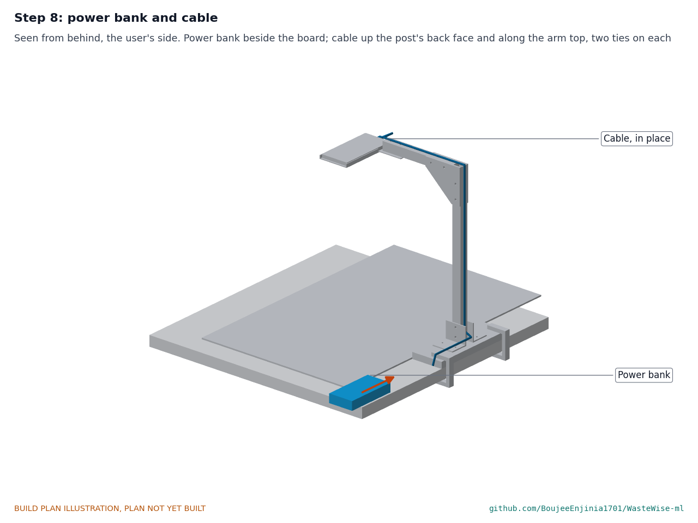

Seen from behind, from the user's side. Stand the power bank on the bench beside the board, clear of the clamp. Run the cable over the board, up the post's back face and along the top of the arm to the phone's charging end, with two cable ties on the post and two on the arm. Leave a loop at the phone so it can lift out of the tray without unplugging. **Hold point:** safety stop S3 in section 6.

## 5. First checks

These are the checks a TRL 4 test report would record; this plan only lists them. Requirement numbers are those of WML-REQ-001; the camera geometry is from WML-CAL-001 section 6.

*Table 2. First checks.*

| Check | Requirement | How | Pass when |
| --- | --- | --- | --- |
| Camera height | R1 (camera geometry of WML-CAL-001) | Tape measure from the mat to the tray's underside beside the window | 440, give or take 5 |
| Picture on the mat | R1 | Phone in the tray, camera app open, mat in place | Every edge of the picture shows grey mat: no bench, no board, no stand |
| Picture square to the mat | R1 | Look at the grid in the camera picture | Grid lines run parallel to the picture's edges and the squares look square |
| Stand rigid | R7 | Tap the screen firmly at its far corner, as a user would | The picture moves less than one grid line's width and settles at once |
| Phone in and out | R7 | Lift the phone out and put it back, ten times | Each takes under 5 s and the bump always finds the window |
| Screen clear | R8 | Stand at the user's side of the bench | The whole screen can be seen and tapped; nothing of the rig covers it |
| Power through a shift | R10 | Phone on the power bank's cable, screen sleeping between taps | The phone charges; the cable does not pull when the phone is lifted |
| No glare | R1 | Site light on; look at the camera picture | No bright patch on the mat |

## 6. Safety stops

Stop at each point. Carry on only when everything listed is true.

- **S1. Before cutting and drilling.** Stock held in a vice or clamped to the drill table, never by hand; safety glasses on; long hair tied back; no gloves near a turning drill.
- **S2. Before the stand is handled.** Every cut edge, hole and corner of the tube, angles, plates and tray deburred and filed; the tray's corners rounded.
- **S3. Before the power bank and phone are connected.** Power bank and phone undamaged, not swollen and not hot; the cable undamaged; the power bank on the bench in shade, away from metal in direct sun and away from the hazard box.
- **S4. Before the rig is used at a sorting station.** Both G-clamps tight; the stand passes the hold point of step 5; the rig is in shade, since a phone in direct sun overheats and slows; the hazard box and sharps container are in place and the people using the rig have been briefed that hazards go to the box and are never photographed by holding them under the phone.
- **S5. Collecting hazard photos for the dataset (outside this plan).** Only by people trained for it, under the data protocol agreed with the partner: hazards are photographed where they lie, or with sharps inside a rigid container or held with tongs.

## 7. Tools, skills and workspace

**Tools.** Hacksaw with a 24 teeth per inch blade and a mitre box (or a mitre saw with a non-ferrous blade); handsaw or jigsaw for plywood and hardboard; aviation snips or a jigsaw with a metal blade; bench vice with soft jaws and two hardwood blocks about 200 long for folding; drill in a drill stand; drills 3, 4.5, 5.5 and 6; countersink; flat and half-round files; deburring tool; scriber, engineer's square, steel rule, calipers and tape measure; spirit level; screwdriver; 8 mm spanner and socket; paintbrush or small roller and a fine paint marker; sandpaper.

**Skills.** No certified trade is needed. Basic workshop skills: marking out, sawing, drilling, filing and folding thin sheet, and painting. There is no wiring: the only electrical parts are the bought phone, power bank and USB cable.

**Workspace.** A bench about 1.2 x 0.6 m with a vice; a dust-free, ventilated place for painting and varnishing the mat and leaving it to dry flat.

**Personal protective equipment.** Safety glasses for sawing, drilling and filing; cut-resistant gloves for handling cut aluminium; a dust mask for sanding hardboard; no gloves near a turning drill.

## 8. Where the numbers come from

- Model and constructability checks: `cad/src/model.py` (`python cad/src/model.py --check`, 99 checks); STEP and STL exports in `cad/step/` and `cad/stl/`.
- Pictures: `cad/src/build_plan_media.py`, using `.kit/build_views.py`; written to `docs/05-build-plan/` and `cad/drawings/WML-DWG-101` to `WML-DWG-107`.
- General arrangement: `cad/drawings/WML-DWG-001.pdf`, Rev P2.
- Calculations: `docs/04-calcs/01-sizing.md` (WML-CAL-001 v0.3) and `docs/04-calcs/sizing.py`; camera geometry and stand clearance in section 6, cost in section 10.
- Bill of materials: `bom/bom.csv`, lines 1, 2, 3, 6 and 11.
- Decisions: `docs/decisions/0003-design-for-construction.md` (WML-DDR-003), with WML-DDR-001 and WML-DDR-002.
- Requirements: `docs/03-requirements.md` (WML-REQ-001 v0.4).
